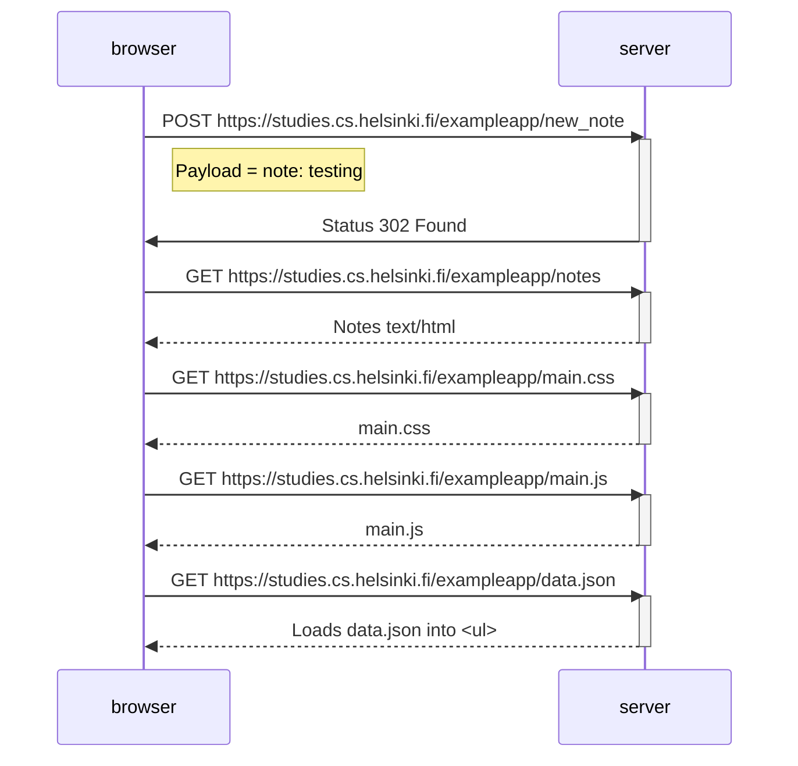

```mermaid
sequenceDiagram
  participant browser
  participant server

  browser ->>server: POST https://studies.cs.helsinki.fi/exampleapp/new_note
  activate server

  Note right of browser: Payload = note: testing

  server ->>browser: Status 302 Found
  deactivate server

  browser->>server: GET https://studies.cs.helsinki.fi/exampleapp/notes
    activate server
    server-->>browser: Notes text/html
    deactivate server

    browser->>server: GET https://studies.cs.helsinki.fi/exampleapp/main.css
    activate server
    server-->>browser: main.css
    deactivate server

    browser->>server: GET https://studies.cs.helsinki.fi/exampleapp/main.js
    activate server
    server-->>browser: main.js
    deactivate server


    browser->>server: GET https://studies.cs.helsinki.fi/exampleapp/data.json
    activate server
    server-->>browser: Loads data.json into <ul>
    deactivate server

```